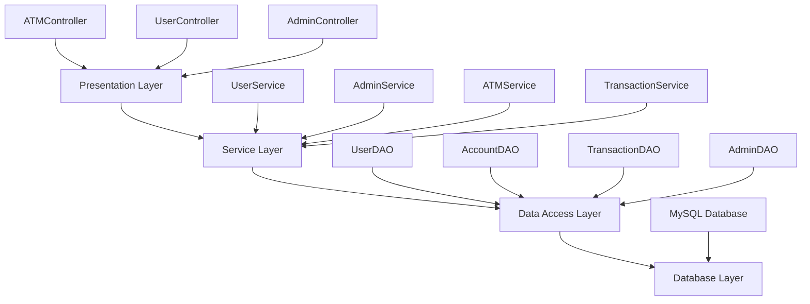
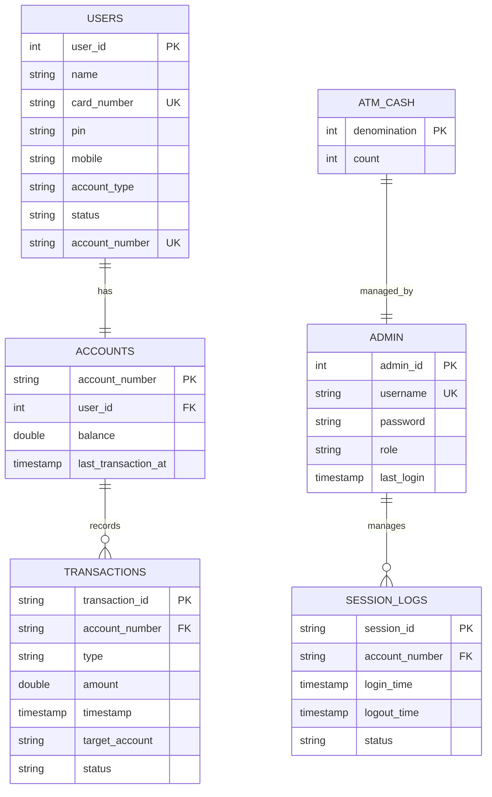
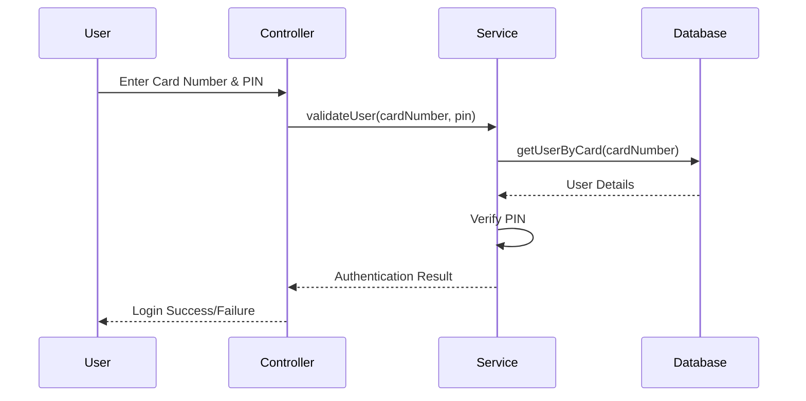

# 🏧 ATM Simulator - Java Banking System

<div align="center">


**A comprehensive ATM banking system simulation built with Java, MySQL, and Maven**

[Features](#features) • [Installation](#installation) • [Usage](#usage) • [Testing](#testing) • [Documentation](#documentation)

</div>

---

## 📋 Table of Contents

- [🎯 Overview](#-overview)
- [✨ Features](#-features)
- [🏗️ Architecture](#️-architecture)
- [🛠️ Technology Stack](#️-technology-stack)
- [📦 Installation](#-installation)
- [🚀 Usage](#-usage)
- [🧪 Testing](#-testing)
- [📁 Project Structure](#-project-structure)
- [💾 Database Schema](#-database-schema)
- [👤 User Operations](#-user-operations)
- [👨‍💼 Admin Operations](#-admin-operations)
- [🔒 Security Features](#-security-features)
- [📊 Sample Data](#-sample-data)
- [🤝 Contributing](#-contributing)
- [📄 License](#-license)

---

## 🎯 Overview

The **ATM Simulator** is a full-featured banking system simulation that replicates real-world ATM operations. Built using modern Java technologies, it provides a secure, reliable, and user-friendly interface for both customers and administrators.

### 🎥 Demo Preview

```
=================================
||   WELCOME TO ABC BANK ATM   ||
=================================

Insert your card to continue...
1. User Login
2. Admin Login
3. Exit
Choose: 1

Enter Card Number: 1234567890123456
Enter PIN: 1234
Login successful.

===============================
1. Check Balance
2. Withdraw Cash
3. Deposit Cash
4. Transfer Funds
5. Change PIN
6. Mini Statement
7. Transaction History
8. Exit
===============================
```

---

## ✨ Features

### 🏦 **Core Banking Operations**
- ✅ **User Authentication** - Secure login with card number and PIN
- ✅ **Balance Inquiry** - Real-time account balance checking
- ✅ **Cash Withdrawal** - Secure money withdrawal with limits
- ✅ **Cash Deposit** - Easy money deposit functionality
- ✅ **Fund Transfer** - Transfer money between accounts
- ✅ **PIN Management** - Change PIN securely
- ✅ **Transaction History** - Complete transaction records
- ✅ **Mini Statement** - Last 5 transactions summary

### 👨‍💼 **Administrative Features**
- 🔧 **ATM Cash Management** - Monitor and refill ATM cash
- 📊 **User Session Monitoring** - Track active user sessions
- 🔐 **Admin Authentication** - Secure admin panel access
- 💰 **Cash Inventory Control** - Manage different denominations

### 🛡️ **Security & Validation**
- 🔒 **PIN Encryption** - Secure PIN hashing with salt
- 🚫 **Account Blocking** - Automatic blocking after failed attempts
- ✅ **Input Validation** - Comprehensive data validation
- 🎭 **Card Number Masking** - Secure display of sensitive data
- 🆔 **Unique Transaction IDs** - Trackable transaction references

---

## 🏗️ Architecture

The application follows a **layered architecture** pattern:



### 📦 **Package Structure**

```
com.atm/
├── 🎮 controller/     # User interface controllers
├── 🔧 service/        # Business logic services
├── 💾 dao/           # Data access objects
├── 📝 model/         # Entity models
├── 🔒 security/      # Security utilities
├── ⚙️ config/        # Configuration classes
├── 🛠️ util/          # Utility classes
├── 📊 dto/           # Data transfer objects
├── 🗺️ mapper/        # Object mappers
└── ❌ exception/     # Custom exceptions
```

---

## 🛠️ Technology Stack

<table>
<tr>
<td align="center" width="33%">

### 🚀 **Backend**


</td>
<td align="center" width="33%">

### 💾 **Database**


</td>
<td align="center" width="33%">

### 🧪 **Testing**


</td>
</tr>
</table>

### 📚 **Dependencies**

| Dependency | Version | Purpose |
|------------|---------|---------|
| `mysql-connector-j` | 8.4.0 | MySQL database connectivity |
| `junit-jupiter-api` | 5.11.0 | Unit testing framework |
| `junit-jupiter-params` | 5.11.0 | Parameterized testing |

---

## 📦 Installation

### 🔧 **Prerequisites**

- ☕ **Java 17** or higher
- 🗃️ **MySQL 8.0** or higher
- 📦 **Maven 3.8** or higher
- 🖥️ **IDE** (Eclipse, IntelliJ IDEA, or VS Code)

### 📥 **Setup Instructions**

1. **Clone the Repository**
   ```bash
   git clone https://github.com/yourusername/atm-simulator.git
   cd atm-simulator
   ```

2. **Database Setup**
   ```sql
   -- Create MySQL database
   CREATE DATABASE atmdb;
   
   -- Create user (optional)
   CREATE USER 'atmuser'@'localhost' IDENTIFIED BY 'pass';
   GRANT ALL PRIVILEGES ON atmdb.* TO 'atmuser'@'localhost';
   FLUSH PRIVILEGES;
   ```

3. **Configure Database Connection**
   ```java
   // Update src/main/java/com/atm/config/DatabaseConfig.java
   public static final String DATABASE_URL = "jdbc:mysql://localhost:3306/atmdb";
   public static final String DATABASE_USER = "root";
   public static final String DATABASE_PASSWORD = "pass";
   ```

4. **Build and Run**
   ```bash
   # Compile the project
   mvn clean compile
   
   # Run tests
   mvn test
   
   # Run the application
   mvn exec:java -Dexec.mainClass="com.atm.ATMApplication"
   ```

---

## 🚀 Usage

### 🔐 **User Login**

Use these **sample accounts** for testing:

| Name | Card Number | PIN | Account | Initial Balance |
|------|-------------|-----|---------|----------------|
| John Doe | `1234567890123456` | `1234` | ACC123 | $5,000.00 |
| Jane Smith | `9876543210987654` | `5678` | ACC456 | $3,500.00 |
| Bob Johnson | `1111222233334444` | `9999` | ACC789 | $2,000.00 |

### 👨‍💼 **Admin Login**

| Username | Password | Role |
|----------|----------|------|
| `admin` | `admin123` | SUPER_ADMIN |
| `manager` | `manager123` | MANAGER |

### 🖥️ **Running the Application**

```bash
# Start the ATM Simulator
java -cp target/classes com.atm.ATMApplication
```

---

## 🧪 Testing

The project includes comprehensive **JUnit 5** tests covering all major functionality.

### 🏃‍♂️ **Run Tests**

```bash
# Run all tests
mvn test

# Run specific test class
mvn test -Dtest=AppTest

# Run tests with detailed output
mvn test -Dtest=AppTest -Dtest.verbose=true
```

### 📊 **Test Coverage**

- ✅ **User Authentication** - Login/logout functionality
- ✅ **Account Operations** - Balance, validation, CRUD operations
- ✅ **Transaction Processing** - Withdraw, deposit, transfer
- ✅ **Security Features** - PIN validation, encryption
- ✅ **Admin Operations** - Cash management, user monitoring
- ✅ **Data Persistence** - Database operations
- ✅ **Error Handling** - Exception scenarios

```bash
# Example test output
=== ATM Simulator Tests Starting ===
✅ Database connection working
✅ Input validation working
✅ Security features working
✅ User login working
✅ Balance inquiry working
✅ Withdrawal working
✅ Deposit working
✅ Fund transfer working
✅ PIN change working
✅ Admin operations working
✅ Transaction history working

========================================
  ATM SIMULATOR TESTS COMPLETED
========================================
✅ All tests passed successfully!
```

---

## 📁 Project Structure

```
ATMSimulator/
├── 📄 pom.xml                           # Maven configuration
├── 📖 README.md                         # Project documentation
├── 📂 src/
│   ├── 📂 main/
│   │   └── 📂 java/
│   │       └── 📂 com/atm/
│   │           ├── 🎮 controller/        # UI Controllers
│   │           │   ├── ATMController.java
│   │           │   ├── UserController.java
│   │           │   └── AdminController.java
│   │           ├── 🔧 service/           # Business Logic
│   │           │   ├── ATMService.java
│   │           │   ├── UserService.java
│   │           │   ├── AdminService.java
│   │           │   └── impl/
│   │           ├── 💾 dao/               # Data Access
│   │           │   ├── UserDAO.java
│   │           │   ├── AccountDAO.java
│   │           │   └── impl/
│   │           ├── 📝 model/             # Entity Models
│   │           │   ├── User.java
│   │           │   ├── Account.java
│   │           │   ├── Transaction.java
│   │           │   └── Admin.java
│   │           ├── 🛠️ util/              # Utilities
│   │           │   ├── DatabaseUtil.java
│   │           │   ├── SecurityUtil.java
│   │           │   └── InputValidator.java
│   │           ├── ⚙️ config/            # Configuration
│   │           │   ├── ATMConfig.java
│   │           │   └── DatabaseConfig.java
│   │           ├── 📊 dto/               # Data Transfer Objects
│   │           ├── 🗺️ mapper/            # Object Mappers
│   │           ├── ❌ exception/          # Custom Exceptions
│   │           └── 📱 ATMApplication.java # Main Application
│   └── 📂 test/
│       └── 📂 java/
│           └── 📂 com/atm/
│               └── 🧪 AppTest.java       # Test Suite
├── 📂 target/                           # Compiled classes
└── 📂 .mvn/                            # Maven wrapper
```

---

## 💾 Database Schema

### 📊 **Entity Relationship Diagram**



### 📋 **Table Descriptions**

| Table | Purpose | Key Fields |
|-------|---------|------------|
| `users` | Store customer information | card_number, pin, account_number |
| `accounts` | Store account balances | account_number, balance |
| `transactions` | Record all transactions | transaction_id, type, amount |
| `admin` | Admin user credentials | username, password, role |
| `atm_cash` | ATM cash inventory | denomination, count |
| `session_logs` | User session tracking | session_id, login_time |

---

## 👤 User Operations

### 💳 **Authentication Flow**



### 💰 **Transaction Operations**

| Operation | Min Amount | Max Amount | Special Rules |
|-----------|------------|------------|---------------|
| **Withdrawal** | $20 | $5,000 | Must be multiple of $20 |
| **Deposit** | $1 | No limit | Any positive amount |
| **Transfer** | $1 | Account balance | Valid recipient required |

### 📊 **Transaction Types**

- 🏧 **WITHDRAWAL** - Cash withdrawal from account
- 💵 **DEPOSIT** - Cash deposit to account  
- 🔄 **TRANSFER_OUT** - Outgoing fund transfer
- 🔄 **TRANSFER_IN** - Incoming fund transfer
- ❌ **FAILED** - Failed transaction record

---

## 👨‍💼 Admin Operations

### 🔧 **Admin Dashboard**

```
====== Admin Menu ======
1. Check ATM Cash         💰 $15,750
2. Refill ATM            ➕ Add denominations
3. View User Logs        👥 Active sessions
4. Exit                  🚪 Logout
```

### 💵 **Cash Management**

| Denomination | Default Count | Value |
|--------------|---------------|-------|
| $20 | 100 notes | $2,000 |
| $50 | 50 notes | $2,500 |
| $100 | 30 notes | $3,000 |
| $500 | 20 notes | $10,000 |
| $1000 | 10 notes | $10,000 |
| **Total** | **210 notes** | **$27,500** |

---

## 🔒 Security Features

### 🛡️ **Security Measures**

- **🔐 PIN Encryption**: SHA-256 hashing with salt
- **🎭 Data Masking**: Card numbers displayed as `1234-****-****-3456`
- **🚫 Account Locking**: Auto-block after 3 failed attempts
- **✅ Input Validation**: Comprehensive data validation
- **🆔 Session Management**: Secure session tracking
- **📝 Audit Trail**: Complete transaction logging

### 🔑 **Security Code Example**

```java
// PIN Hashing with Salt
String salt = SecurityUtil.generateSalt();
String hashedPin = SecurityUtil.hashPin("1234", salt);
boolean isValid = SecurityUtil.verifyPin("1234", hashedPin, salt);

// Card Number Masking
String masked = SecurityUtil.maskCardNumber("1234567890123456");
// Output: "1234-****-****-3456"
```

---

## 📊 Sample Data

### 👥 **Pre-loaded Test Users**

```json
{
  "users": [
    {
      "name": "John Doe",
      "cardNumber": "1234567890123456",
      "pin": "1234",
      "account": "ACC123",
      "balance": 5000.00,
      "type": "savings"
    },
    {
      "name": "Jane Smith", 
      "cardNumber": "9876543210987654",
      "pin": "5678",
      "account": "ACC456", 
      "balance": 3500.00,
      "type": "current"
    },
    {
      "name": "Bob Johnson",
      "cardNumber": "1111222233334444", 
      "pin": "9999",
      "account": "ACC789",
      "balance": 2000.00,
      "type": "savings"
    }
  ]
}
```

---

## 🤝 Contributing

We welcome contributions! Please follow these steps:

1. **🍴 Fork** the repository
2. **🌿 Create** a feature branch (`git checkout -b feature/AmazingFeature`)
3. **💾 Commit** your changes (`git commit -m 'Add some AmazingFeature'`)
4. **📤 Push** to the branch (`git push origin feature/AmazingFeature`)
5. **🔀 Open** a Pull Request

### 📋 **Development Guidelines**

- Follow **Java naming conventions**
- Write **comprehensive tests**
- Add **JavaDoc documentation**
- Follow **SOLID principles**
- Use **meaningful commit messages**

---

## 📄 License

This project is licensed under the **MIT License** - see the [LICENSE](LICENSE) file for details.

---

<div align="center">

### 🎯 **Project Stats**


**Made with ❤️ by [Vivek Shivam Yadav]**

⭐ **Star this repo if you found it helpful!**

</div>

---

### 📞 **Support & Contact**

- 📧 **Email**: viveksy13@example.com
- 💬 **Issues**: [GitHub Issues](https://github.com/Vivek-Shivam-Yadav/atm-simulator-java/issues)

---

*Last updated: January 2025*